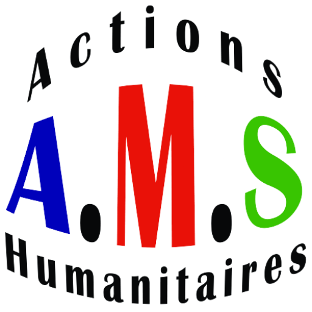

<h1 align="center">👋 Hello World! I'm <strong>Ziad Zin</strong> — you can call me <strong>ZiN</strong>, your friendly neighborhood dev 💻</h1>

---

  

<em>📍 Proud student at 1337-Benguerir — learning, building, and breaking things with code.</em>

---

### 👨‍💻 About Me

I'm a passionate developer who loves solving real-world problems through code.  
I've collaborated with small businesses to deliver meaningful digital solutions.  
Curious by nature and constantly learning — always building something new.

---

### 🤝 Community & Impact

I'm proud to be a member of the nonprofit association **A.M.S (Association Maghreb Solidarité)**,  
dedicated to creating meaningful change across the Maghreb region.  

Founded by **Mr. Abdeljabar EDDAHI**.

  

  Association Maghreb Solidarité

  

  <em>Homepage preview of <a href="https://maghrebsolidarite.com" target="_blank">maghrebsolidarite.com</a></em>

